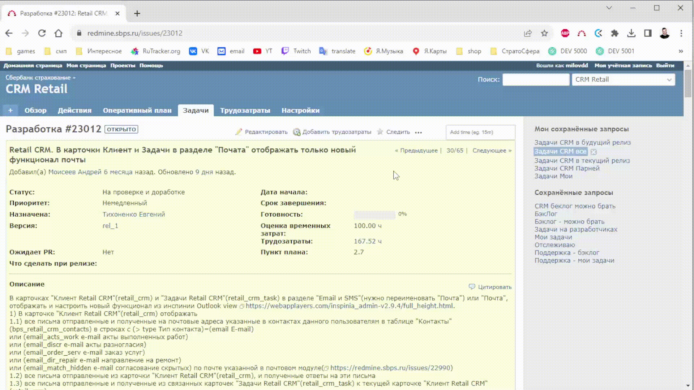
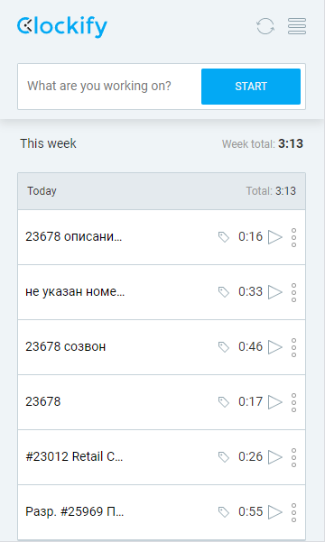

## About
1. Запустите таймер прямо из задачи почти в 3 клика и точка:

p.s. в поле справа от "Start timer" можно внести фиксированное время, если забыли запустить таймер.<br><br>
2. В течение дня у вас может получится такая картина (задача 23678 повторятеся несколько раз с одной и той же деятельностью; дело в том, что Clockify не группирует данные записи, т.к. описание разное):

3. Информативно и удобно отмечать затраченное время в Redmine; вы не сможете затрекать, если не укажете номер задачи:

P.S. Все трудочасы группируются по номеру задачи и деятельности, поэтому у вас в Redmine не будет "спама" трудочасами. Можно много раз в течение дня засекать по 10 минут в задачу Х с одной и той же деятельностью, в результате clockmine сделает только 1 запись в Redmine.

## Почему Clockify?
Я попробовал много разных приложений для засекания времени и выработал такие основные критерии:
1. Данные не хранятся локально, привет арч
2. Есть возможность запустить таймер нажимая кнопки, а не печатая номер задачи каждый раз
3. Поддерживает выбор деятельности опять же кликами на кнопки, а не ручным вводом
4. Имеет расширение в магазине ГуглХрома
5. Есть возможность запустить таймер, и есть возможность вбить фиксированное время
Clockify всем этим критериям удовлетворяет.<br>
p.s. спасибо Виктору Фадееву за то, что когда-то порекомендовал этот сервис

### Минусы Clockify
1. В расширении ГуглХрома иногда вылетает из аккаунта, но таймер не останавливается, и время не "обнуляется"
2. Доступность сервиса сильно зависит от РКН, 1-2 раза за год были проблемы с доступом, т.к. в такие моменты в целом плохо работали все Гугл штуки
3. Громоздкий интерфейс на официальной странице из-за того, что изначально Clockify задумывается авторами как аналог Redmine, но туда я захожу раз в полгода и то случайно, плюс привыкаешь игнорировать всё лишнее

## Установка (до 15 минут)

### 1. Атака клонов
```bash
git clone https://github.com/2Dmitry/clockmine.git
```
```bash
cd clockmine
```
```bash
cp ./deploy/example/.env ./.env
```

### 2. Учетные записи
#### 2.1 Readmine
- Заходим в [`Моя учётная запись`](https://redmine.sbps.ru/my/account);
- В крайнем правом блоке есть "Ключ доступа к API" -> "Показать";
- Копируем API-ключ для вашей учетной записи Redmine и присваиваем это значение переменной `REDMINE_API_KEY` в `.env` файле.
#### 2.2 Clockify
- Создаем или логинимся (если уже есть) в учетную запись [`Clockify`](https://app.clockify.me/en/login), можно использовать учетную запись Google;
- Переходим в [`настройки`](https://app.clockify.me/user/settings) и скролим в самый низ;
- Генерируем API-ключ в соответствующем поле и копируем его в переменную `CLOCKIFY_API_KEY` в `.env` файле;
- Устанавливаем на свой вкус [`приложение`](https://clockify.me/apps), я использовал расширение для Google Chrome (рекомендую именно расширения для браузеров, т.к. они позволяют нажатием одной кнопки запускать таймер прямо из задачи в Redmine);
- _(по желанию)_ **Если** установили одно из приложений, **то** переходим в настройки этого приложения. Оставляем включенными только одну опцию: "Показывать всплывающее окно"; Что значит опция "Включить контекстное меню" я так и не понял
- _(по желанию)_ Переходим в [`Настройки Clockify`](https://app.clockify.me/workspaces/), затем - в "Настройки" у конкретного "Workspace", затем - во вкладку "Разрешения", затем деактивируем "Активировать оплачиваемые часы".
- **Если** установили одно из приложений, **то** заходим в настройки расширения Clockify для браузера, затем:
  * Переходим в "Интеграции";
  * _(по желанию)_ отключаем все интеграции;
  * В поле `Custom domain url` вводим `https://redmine.sbps.ru` - на конце обязательно не должно быть слеша, проверьте;
  * В выпадающем списке выбираем `Redmine`;
  * Нажимаем `ADD`;
  * Нажимаем `refresh` в установленном приложении и заходим в любую Redmine-задачу. Видим, что появилась кнопка `Start timer`. Profit.

### 3. Предварительная настройка Clockmine
- **Если** ваша таймзона отличается от `Europe/Moscow`, **то** в `.env` файле меняем значение переменной `TIMEZONE` на таймзону из списка разрешенных таймзон, перечисленных в файле `timezones.py`;
  * Default: таймзоной по умолчанию выбрана `Europe/Moscow`.
- _(по желанию)_ Можно в .env файле в переменной `REDMINE_URL_TIME_ENTRY` указать любую ссылку, которая будет выводится в консоль сразу после того, как вы успешно выполните команду `push` (о которой мы поговорим чуть позже);
  * Default: в консоль выводится [`такая`](https://redmine.sbps.ru/time_entries?utf8=%E2%9C%93&set_filter=1&sort=spent_on%3Adesc&f%5B%5D=spent_on&op%5Bspent_on%5D=w&f%5B%5D=user_id&op%5Buser_id%5D=%3D&v%5Buser_id%5D%5B%5D=me&f%5B%5D=&c%5B%5D=created_on&c%5B%5D=hours&c%5B%5D=activity&c%5B%5D=user&c%5B%5D=project&c%5B%5D=issue&group_by=spent_on&t%5B%5D=hours&t%5B%5D=) ссылка.
- В переменной `REDMINE_ACTIVITIES_NOT_ALLOWED` указываем в формате python-списка деятельность, которой вы не пользуетесь при проставлении трудочасов;
  * Default: из доступных дейтельностей исключён "Безнес-анализ".

### 4. Полетели
```bash
docker-compose build
```
(если настроены алиасы, то командой `dc build`)
```bash
docker-compose up -d
```
(если настроены алиасы, то командой `dc up -d`)

При первом запуске выполняем команду:
```bash
docker-compose exec app ./manage.py init
```

### 5. Как пользоваться
1. Запускаем таймер:
- **Либо** Открываем задачу в Redmine и нажимаем кнопку "Start timer".
- **Либо** Вводим в Clockify номер Redmine задачи, запускаем таймер.
2. _(по желанию)_ Выбираем тег/деятельность (если тег не выбран, то в момент переноса времени в Redmine будет выбран тег/деятельность "Разработка").
3. Останавливаем таймер одним из спосбов:
- **Либо** нажимаем "Стоп" в Clockify
- **Либо** открываем задачу в Redmine, нажимаем кнопку "Start timer", смотрим п.2
- **Либо** выполняем в терминале команду `report` и/или команду `push`
`docker-compose exec app ./manage.py report`
`docker-compose exec app ./manage.py push`

### 6. Правила
1. В описании/заголовке затреканного времени в Clockify обязательно должен быть номер задачи, к которой у вас есть доступ в Redmine.
2. Для успешного выполнения команды `docker-compose exec app ./manage.py push` каждая распаршенная запись из Clockify должна иметь `True` в колонке `Можно затрекать`.
3. **Если** у вас запущен таймер, т.к. вы забыли его остановить, **то** clockmine самостоятельно остановит текущий таймер.
4. **Если** вы не выбрали никакой тег (аналог "Деятельность" в Redmine) в записи Clockify, **то** этой записи будет автоматически присвоен тег/деятельность "Разработка".
5. Время будет затрекано в Redmine в ту дату, в которую был сделан старт таймера в Clockify.
- **Если** вы работали в пятницу и забыли затрекать, **то**, после успешного выполнения команды "push" в понедельник, время будет затрекано в пятницу.
- **Если** вы начали трекать время в 23:30 вторника, а закончили в 1:00 среды, **то** время будет затрекано во вторник.
6. Информация о затреканном времени удаляется из Clockify сразу после того, как была успешно перенесена в Redmine.
7. **Если** вы указали несколько тегов/деятельностей в Clockify, **то** будет взята первая деятельность.

### 7. Варианты команд
```
docker-compose exec app ./manage.py --help
docker-compose exec app ./manage.py init
docker-compose exec app ./manage.py report
docker-compose exec app ./manage.py report --coeff 0.5
docker-compose exec app ./manage.py report --target 5.0
docker-compose exec app ./manage.py push
docker-compose exec app ./manage.py push -c 0.5
docker-compose exec app ./manage.py push -t 5.0
```
- введенное вами число пройдет валидацию, если будет больше нуля;
- report - получить информацию о затреканном времени из Clockify;
- push - перенести затреканное время из Clockify в Redmine и удалить всё затреканное время в Clockify;
- coeff - умножает каждое затреканное время на значение coeff, т.е. можно легко затрекать 0.5 времени и не считать самому;
- target - указывает итоговое суммарное значение затреканного времени, т.е. если вы суммарно затрекали 6.0h, но знаете, что 30m оказывали консультации во многих задачах по чуть-чуть и никак не могли рационально затрекать это время, то указывайте `--target 6.5`.

## Разработка
0. Прикрутить ТГ-бота, через который можно было бы выполнять все команды
1. Добавить GIF-анимации, завернутые в details тег, для информативности инструкции, т.к. некоторые моменты по настройке не совсем очевидны
2. minor Clockify-API предоставляет информацию о времени начала запуска таймера и о времени окончания, на основе этих двух данных можно строить временные интервалы, которые бы показывали, когда работали, а когда делали перерывы
3. Asyncio
4. (вроде сделал, проверить) Отформатировать report-таблицу, сейчас слишком громоздко
5. При парсинге номера задачи на месте проверять, что у пользователя есть доступ к этой задаче (сейчас это проверяется "частично": проверяется, что задача входит в диапазон от самой ранней до самой поздней задачи, к которой есть доступ)
6. ...
